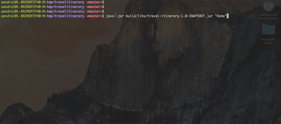

# Travel Itinerary Builder

An example of a command line application to generate an awesome itinerary. 
For build your itinerary we are consuming the services from GoEuro to help us to give you the best tip.


#### Technologies
- Gradle
- JDK 1.8
- Spring Boot:
- Spring-Web
- Mockito
- Junit

### Installation
#### Requirements
- JDK 1.8

Executing the command below, it'll install all the project dependencies and build the package.

```
    ./gradlew build
```

### Running

```
    java -jar build/libs/travel-itinerary-1.0-SNAPSHOT.jar "<CITY>"
```


### How to check your nex itinerary
1. If you chose to go to Rome you need execute this command: 
```
java -jar build/libs/travel-itinerary-1.0-SNAPSHOT.jar "Rome"
```

2. The application will generate a CSV file with all your itinerary. Have a good trip!



